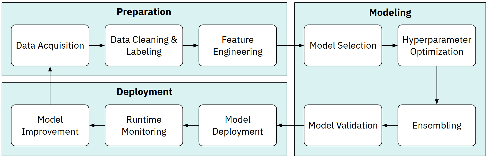

# ML Pipeline Overview

<figure>
  
  <figcaption>Source: Wang et al. (2019), "Human-AI Collaboration in Data Science".</figcaption>
</figure>

| Pipeline Stage                | Description                                                                                     | Our Focus |
| ----------------------------- | ----------------------------------------------------------------------------------------------- | :-------: |
| Data Acquisition              | Sourcing, gathering, and ingesting raw data for the project.                                    |           |
| Data Labeling                 | Assigning target labels to data, often via human annotation.                                    |           |
| **Data Cleaning**             | Correcting errors, handling missing values, and standardizing data.                             |     ✅     |
| **Feature Engineering**       | Selecting and creating new features to improve model performance.                               |     ✅     |
| **Model Selection**           | Choosing the appropriate algorithm or model architecture (e.g., Random Forest, Neural Network). |     ✅     |
| **Hyperparameter Optimization & Neural Architecture Search** | Tuning model settings (e.g., learning rate) to maximize performance.                          |     ✅     |
| **Ensembling**                | Combining predictions from multiple models to achieve higher accuracy.                          |     ✅     |
| **Model Validation**          | Evaluating the final model on unseen data to estimate real-world performance.                   |     ✅     |
| Model Deployment              | Integrating the trained model into a production environment.                                    |           |
| Runtime Monitoring            | Tracking the model's live performance, latency, and data drift.                                 |           |
| Model Improvement             | Using feedback and new data to retrain and improve the model.                                   |           |
